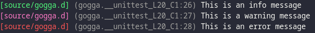

<p align="center">

</p>

<br>

<h3 align="center"><i><b>Simple VT100 colourised pretty-printing logger</i></b></h3>

---

<br>
<br

## Usage

The API is rather straight-forward, simply create a new logger and then you can use it as such:

```d
import gogga;

GoggaLogger gLogger = new GoggaLogger();

gLogger.info("This is an info message");
gLogger.warn("This is a warning message");
gLogger.error("This is an error message");
```

This should output something like the following:



Various [styles](https://gogga.dpldocs.info/v2.1.14/gogga.transform.GoggaMode.html) are supported which can be set using `mode(GoggaMode)`.

---

Or you can also [View the full API](https://gogga.dpldocs.info/v2.1.14/index.html).

